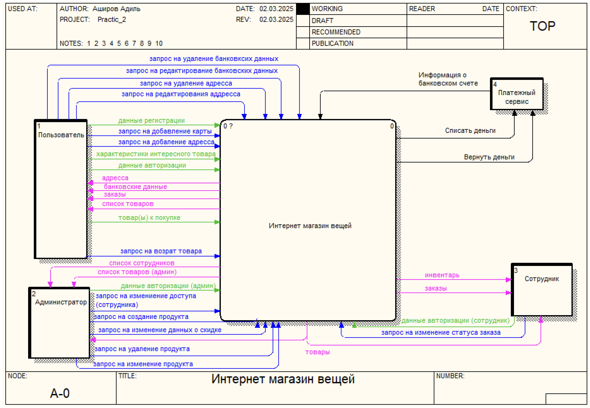
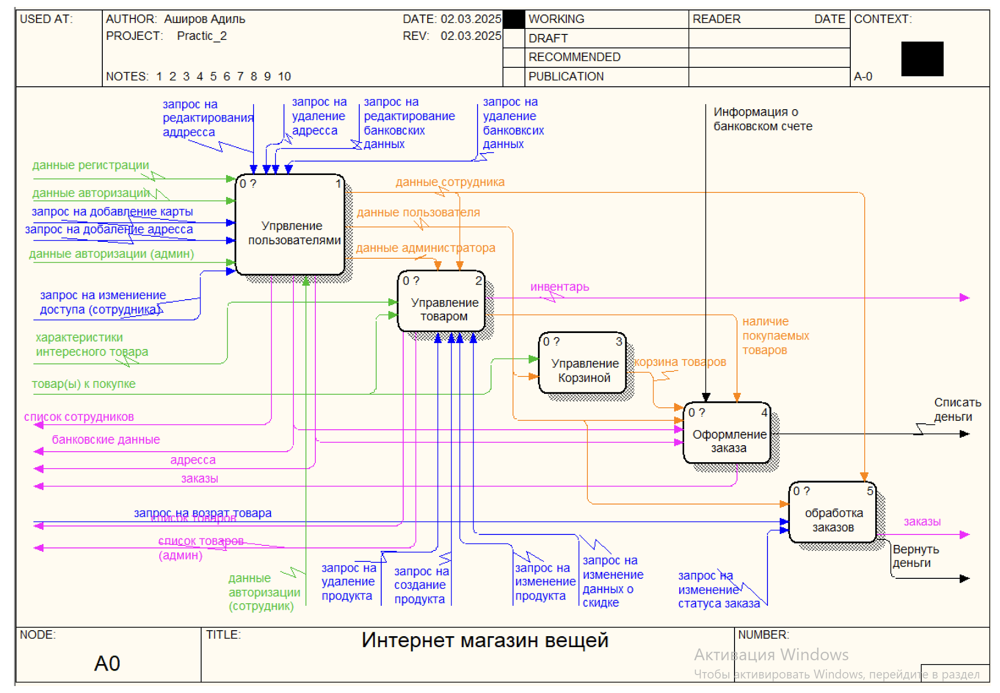
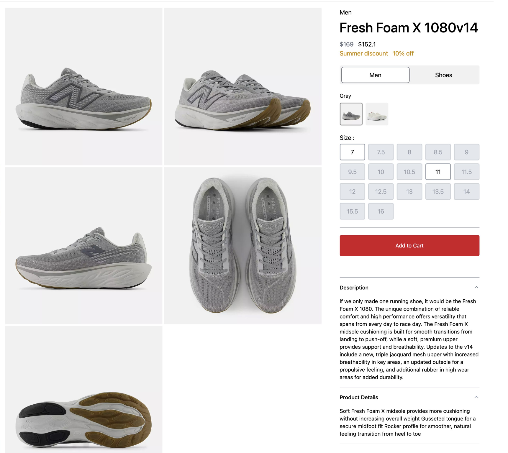
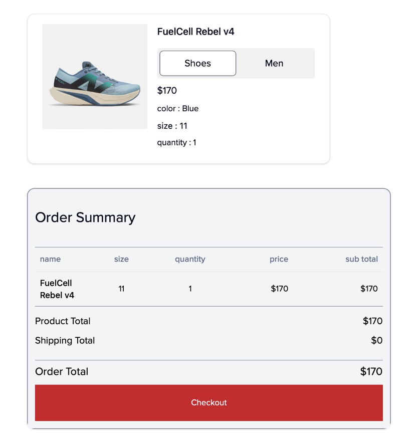
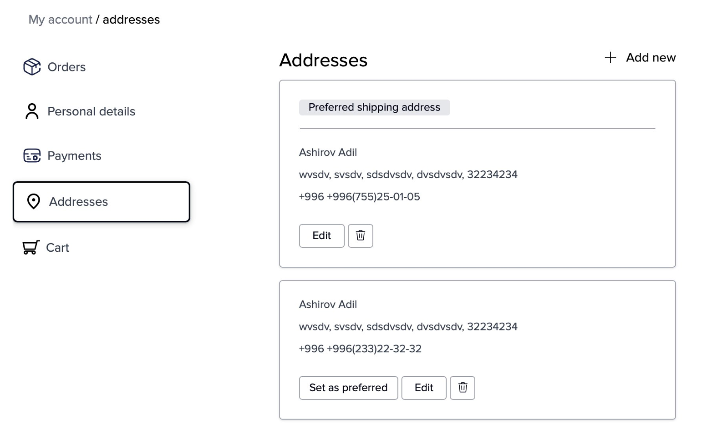
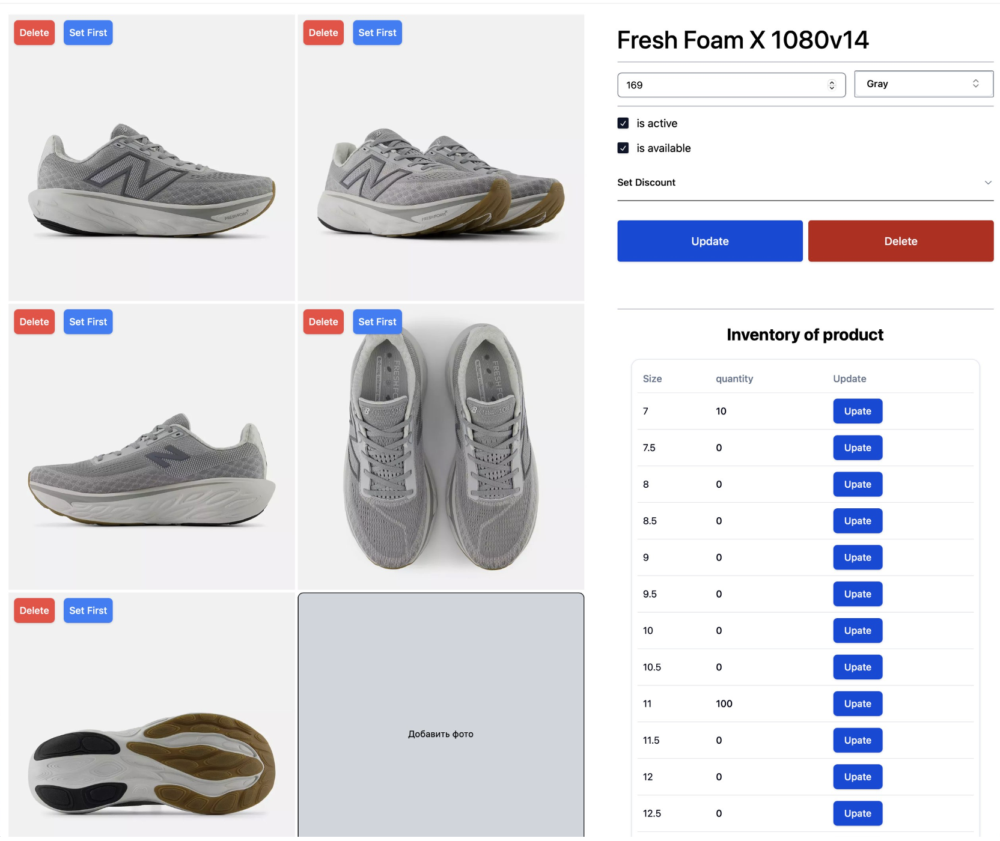

# 🛍️ Modern Sight — Online Clothing Store

## 📌 Description

**Modern Sight** is a modern and scalable web application for an online clothing store, built with a **microservices architecture**.  
Each service is responsible for a specific business domain, improving scalability, maintainability, and performance.

## 🧱 Architecture

The system consists of several microservices:

- 🔐 **account_service** — User registration, authentication, profile, addresses, and payment methods.
- 🛒 **product_service** — Product catalog, categories, collections, inventory, and orders.
- 🖼️ **storage_service** — Media file (e.g., product images) storage and management.
- 🚪 **API Gateway** — Unified entry point for all services, routing requests and handling authentication.
- 📡 **Kafka** — Message broker for asynchronous, event-driven communication between services.

## ⚙️ Technologies Used

| Layer              | Technology Stack                                  |
|--------------------|---------------------------------------------------|
| **Frontend**        | React, TypeScript, Tailwind CSS                  |
| **Backend**         | Node.js, Express, TypeScript                     |
| **Database**        | MongoDB with Mongoose ODM                        |
| **Inter-Service Communication** | Apache Kafka                         |
| **Dev Tools**       | Docker, Git, Jest, Draw.io, MS Excel             |

## 🧩 Features

- ✅ Email-based registration and authentication
- 👤 Personal user dashboard with:
  - Profile management
  - Address and card management
  - Order history
- 🛍️ Product catalog with advanced filtering:
  - By category, brand, collection, and gender
- 🧾 Shopping cart and checkout
- 🛠️ Admin dashboard:
  - Product, brand, color, and size management
  - Inventory and stock tracking
- 🖼️ Media service for image uploading and delivery
- 📦 Kafka-based communication between services

## 📘 Diagrams (to include)

- 📌 **Use Case Diagram**

- 🔄 **DFD (Data Flow Diagram)** – Data flow between system components

- 🏗 **Class Diagram** – Object structure of the system

## 🖼️ Interface Screenshots

### 🏠 1. Home Page
A general overview of the storefront, including product listings and navigation.

---

### 👕 2. Product Details Page
Detailed view of a selected product, including images, description, size, and price.

---

### 🛒 3. Checkout Page
Order placement page where users select delivery address and payment method.

---

### 📍 4. Address List Page
User dashboard section for managing delivery addresses.

---

### ⚙️ 5. Admin Product Management Page
Admin interface for editing, adding, and managing product data.

---

📂 _All images should be placed in the `/assets` folder of the project:_

